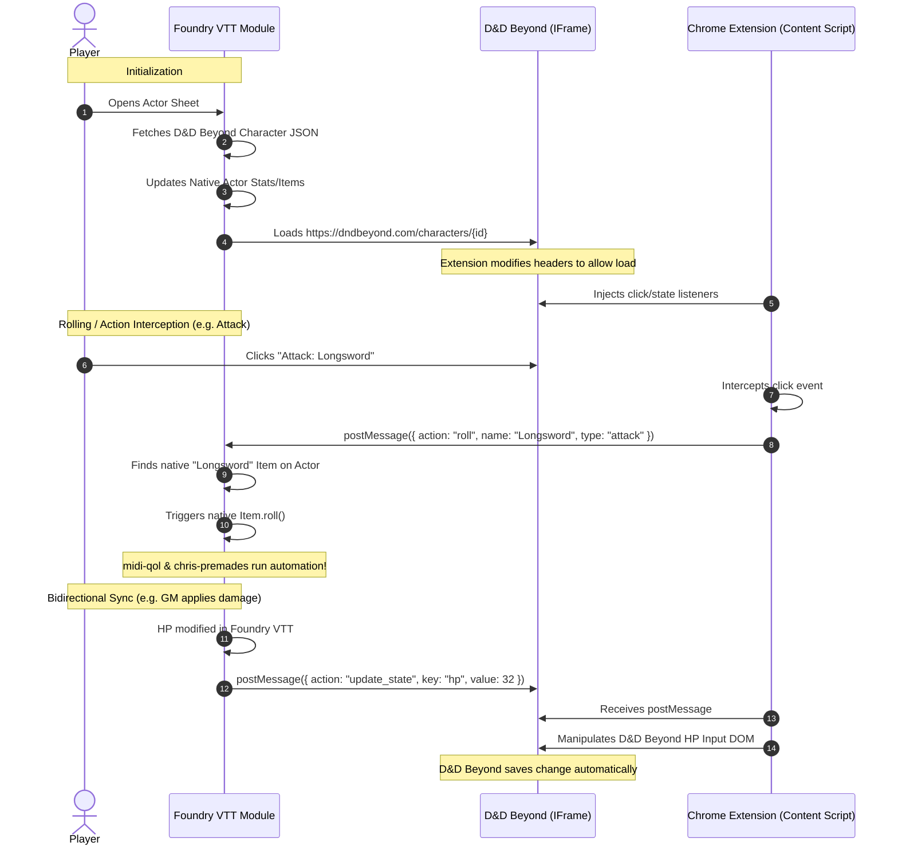

# High Level Solution Design & Architecture

## 1. Architectural Overview
The solution uses a **Local Client-Side Bridge** architecture consisting of two primary components:
1. **Foundry VTT Add-On Module**: Handles native Actor creation, JSON state synchronization, and execution of native roll commands.
2. **Chrome Companion Extension**: Bypasses browser iframe restrictions (HTTP headers) and acts as the event broker between the embedded D&D Beyond page and the Foundry VTT parent page.

## 2. Component Design

### 2.1 Chrome Companion Extension

#### Manifest & Permissions (`manifest.json`)
The extension requires:
* `declarativeNetRequest` (or `webRequest` as fallback) to modify response headers for `*.dndbeyond.com` pages requested by the Foundry domain.
* `activeTab` or host permissions for `https://*.dndbeyond.com/*` and the user's Foundry VTT domain.
* Content script injection for D&D Beyond character pages.

#### Header Stripper (Rules / Background Script)
Modifies response headers on D&D Beyond requests originating from the Foundry VTT domain:
* Remove `X-Frame-Options`
* Modify `Content-Security-Policy` to remove `frame-ancestors` restrictions or add the Foundry VTT domain to allowed ancestors.

#### Content Script (`bridge.js`)
* Injected into `dndbeyond.com/characters/*`.
* **Click Interceptors**:
  * Event listener on elements matching selector structures for attacks, spells, ability checks, saving throws.
  * Translates the clicked DOM node into a payload: `{ action: "roll", type: "attack" | "spell" | "save" | "check", name: "Longsword" | "Fireball" | "Strength" }`.
  * Sends payload to the parent window: `window.parent.postMessage(payload, "*")`.
* **State Sync Observers**:
  * Uses `MutationObserver` on key nodes (HP fields, Spell slots, custom resources).
  * Sends updates to Foundry when the player interacts with D&D Beyond: `window.parent.postMessage({ action: "sync_state", diff: { hp: 45 } }, "*")`.
* **Incoming Message Listener**:
  * Listens to messages from the parent window.
  * Locates the input fields (e.g., HP, temp HP, spell slots) in the DOM and simulates input/change events to update the D&D Beyond state.

### 2.2 Foundry VTT Add-On Module

#### Custom Actor Sheet (`DDBEmbeddedSheet`)
* Subclasses `foundry.applications.api.ApplicationV2` (or `dnd5e.applications.actor.ActorSheet5e` if inheriting native sheet capabilities).
* Renders a layout containing:
  * A thin header/navigation bar with "Sync Stats", "Settings", and connection indicators.
  * An iframe targeting the character's D&D Beyond URL.

#### Event Router (`ddb-router.js`)
* Listens to window message events: `window.addEventListener("message", handleDdbMessage)`.
* Verifies security (checks if sender origin matches `dndbeyond.com`).
* Maps incoming actions to Foundry actor methods:
  * **Attacks/Spells**: Finds an item on the native Actor where `item.name` matches the action name. Executes `item.roll()` or `item.use()`.
  * **Saves/Checks**: Executes `actor.rollAbilitySave(abilityId)` or `actor.rollAbilityTest(abilityId)`.
  * **State Updates**: Updates `actor.update({ "system.attributes.hp.value": newHp })` or updates spell slots in `system.spells`.

#### Native State Importer (`ddb-importer.js`)
* Fetches raw JSON from `https://character-service.dndbeyond.com/character/v2/character/{characterId}`.
* Parses stats, modifiers, classes, race, inventory items, and spells.
* Compares with current native Actor and performs batch updates / item additions to ensure the native sheet is an accurate reflection of the D&D Beyond sheet.
